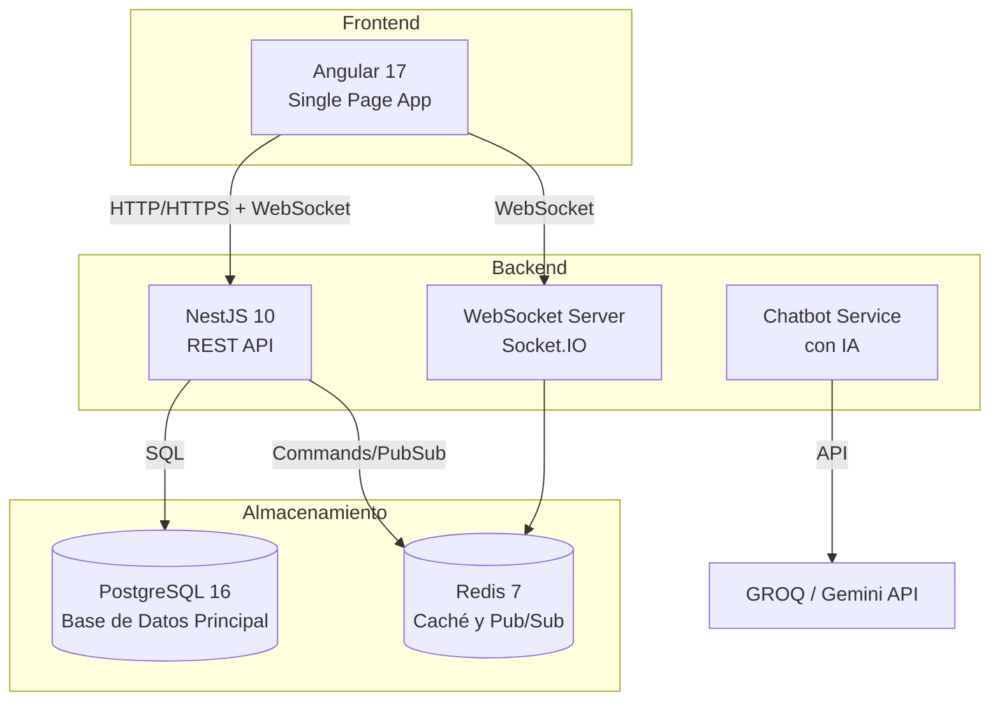
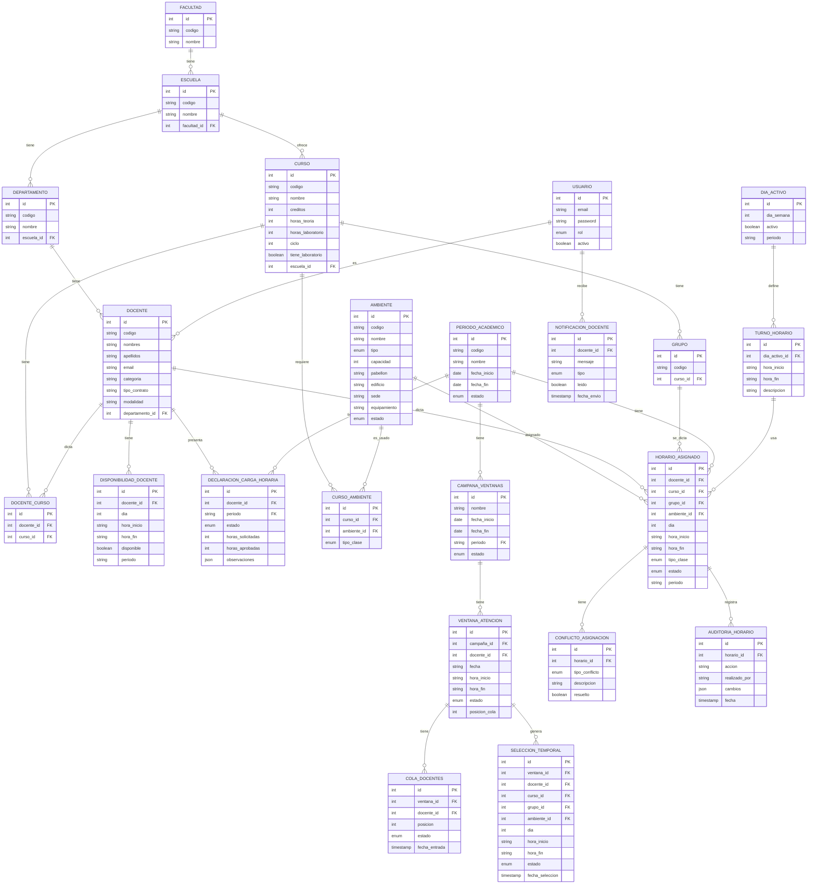

# Horarios UNT — Sistema de Gestión de Horarios Académicos

## Universidad Nacional de Trujillo — Escuela de Ingeniería de Sistemas (EIS)

Sistema web completo para la gestión y asignación de horarios académicos, incluyendo administración de docentes, cursos, ambientes, disponibilidad docente y un módulo de atención por turnos con actualizaciones en tiempo real vía WebSocket.

---

## Diagrama de Arquitectura



---

## Diagrama de Modelado de Datos (ER)



---

## Stack tecnológico

| Capa       | Tecnología                       |
| ---------- | -------------------------------- |
| Backend    | NestJS 10 + TypeScript           |
| Frontend   | Angular 17 + Angular Material 17 |
| ORM        | TypeORM 0.3                      |
| Base datos | PostgreSQL 16                    |
| Caché/WS   | Redis 7 + Socket.IO              |
| Contenedor | Docker + Docker Compose          |
| IA         | GROQ / Gemini API                |

---

## Estructura del proyecto

```
horarios-academicos-unt/
├── backend/                  ← API NestJS
│   ├── src/
│   │   ├── auth/             ← JWT, Guards, Decoradores
│   │   ├── common/           ← Enums, Interceptors, Filters
│   │   ├── entities/         ← Entidades TypeORM
│   │   ├── database/         ← seed.ts y scripts de datos
│   │   └── migrations/       ← Migraciones de BD
│   └── data-source.ts
├── frontend/                 ← Aplicación Angular 17
│   └── src/app/
│       ├── core/             ← Guards, Interceptors, Services
│       ├── layout/           ← Sidebar + Topbar responsive
│       ├── auth/             ← Login
│       └── modules/
│           ├── dashboard/    ← KPIs y gráficos
│           ├── docentes/     ← CRUD Docentes
│           ├── cursos/       ← CRUD Cursos
│           ├── ambientes/    ← CRUD Ambientes
│           ├── disponibilidad/ ← Grilla disponibilidad
│           ├── reportes/     ← Descarga PDFs
│           ├── horarios/     ← Vista horarios (docente/ambiente/conflictos)
│           └── operador/     ← Sistema de turnos WebSocket
├── docker/                   ← Dockerfiles para dev/prod
└── docker-compose.yml
```

---

## Requisitos previos

| Herramienta    | Versión mínima                    |
| -------------- | --------------------------------- |
| Node.js        | 20.x                              |
| npm            | 10.x                              |
| Docker         | 24.x                              |
| Docker Compose | 2.x                               |

---

## Instalación y ejecución

### Opción 1: Usando Docker Compose (Recomendado)

Este método levanta todos los servicios (PostgreSQL, Redis, Backend y Frontend) en contenedores.

1.  **Clonar el repositorio y configurar las variables de entorno:**
    ```bash
    cp .env.example .env
    cp backend/.env.example backend/.env
    ```

2.  **Levantar todos los contenedores:**
    ```bash
    docker-compose up -d --build
    ```

3.  **Esperar a que todos los servicios estén healthy y luego acceder:**
    - **Frontend**: http://localhost:8080
    - **Backend (API)**: http://localhost:3000
    - **Swagger UI (Docs)**: http://localhost:3000/api/docs
    - **pgAdmin (Admin BD)**: http://localhost:5052

### Opción 2: Desarrollo local con contenedores de BD y Redis

Este método es útil si quieres editar el código del backend o frontend con hot-reload.

1.  **Levantar solo BD y Redis con Docker Compose:**
    ```bash
    docker-compose up -d postgres redis pgadmin mailhog
    ```

2.  **Ejecutar el backend localmente:**
    ```bash
    cd backend
    npm install
    # Si es la primera vez o necesitas poblar la BD:
    # Asegúrate que backend/.env tenga DATABASE_PORT=5433
    npm run seed
    npm run start:dev
    ```

3.  **Ejecutar el frontend localmente en una nueva terminal:**
    ```bash
    cd frontend
    npm install
    npx ng serve --port 4200
    ```

---

## Credenciales por defecto

El seeder (`npm run seed`) crea los siguientes usuarios de prueba. **La contraseña de todos es `Admin123!`.**

| Usuario                | Contraseña | Rol                   |
| ---------------------- | ---------- | --------------------- |
| admin@unt.edu.pe       | Admin123!  | Administrador Sistema |
| director@unt.edu.pe    | Admin123!  | Director de Escuela   |
| coordinador@unt.edu.pe | Admin123!  | Coordinador Académico |
| operador@unt.edu.pe    | Admin123!  | Operador de Horarios  |
| docente@unt.edu.pe     | Admin123!  | Docente               |

---

## Variables de entorno

### Variables del proyecto principal (`/.env`)

| Variable                | Valor por defecto                |
| ----------------------- | --------------------------------- |
| `POSTGRES_CONTAINER_NAME` | horarios_postgres              |
| `POSTGRES_PORT`         | 5433                              |
| `POSTGRES_DB`           | horarios_unt                      |
| `POSTGRES_USER`         | unt_user                          |
| `POSTGRES_PASSWORD`     | unt_pass123                       |
| `PGADMIN_CONTAINER_NAME`| horarios_pgadmin                  |
| `PGADMIN_PORT`          | 5052                              |
| `PGADMIN_DEFAULT_EMAIL` | admin@localhost.com               |
| `PGADMIN_DEFAULT_PASSWORD` | admin123                       |
| `REDIS_CONTAINER_NAME`  | horarios_redis                    |
| `REDIS_PORT`            | 6379                              |
| `BACKEND_CONTAINER_NAME`| horarios_backend                  |
| `BACKEND_PORT`          | 3000                              |
| `JWT_SECRET`            | cambia-este-secreto-en-produccion |
| `JWT_EXPIRACION`        | 8h                                |
| `NODE_ENV`              | development                       |
| `FRONTEND_CONTAINER_NAME`| horarios_frontend                |
| `FRONTEND_PORT`         | 8080                              |
| `GROQ_API_KEY`          | (tu clave de GROQ)                |
| `GEMINI_API_KEY`        | (tu clave de Gemini)              |

### Variables del backend (`/backend/.env`)

Solo necesarias si ejecutas el backend localmente (fuera de Docker).

| Variable              | Valor por defecto        |
| --------------------- | ------------------------ |
| `DATABASE_HOST`       | localhost                |
| `DATABASE_PORT`       | 5433                     |
| `DATABASE_NAME`       | horarios_unt             |
| `DATABASE_USER`       | unt_user                 |
| `DATABASE_PASSWORD`   | unt_pass123              |
| `JWT_SECRET`          | horarios_unt_secret_2026 |
| `JWT_EXPIRACION`      | 8h                       |
| `REDIS_HOST`          | localhost                |
| `REDIS_PORT`          | 6379                     |
| `REDIS_URL`           | redis://localhost:6379   |

---

## Descripción de los módulos

| Módulo             | Ruta                  | Descripción                                                                 |
| ------------------ | --------------------- | --------------------------------------------------------------------------- |
| **Login**          | `/login`              | Autenticación JWT                                                           |
| **Dashboard**      | `/app/dashboard`      | KPIs del sistema y gráficos de distribución                                 |
| **Docentes**       | `/app/docentes`       | CRUD de docentes con filtros y paginación                                   |
| **Cursos**         | `/app/cursos`         | CRUD de cursos con prerequisitos y ambientes                                |
| **Ambientes**      | `/app/ambientes`      | CRUD de aulas/laboratorios con equipamiento                                 |
| **Disponibilidad** | `/app/disponibilidad` | Grilla semanal de disponibilidad por docente                                |
| **Reportes**       | `/app/reportes`       | Descarga de PDFs por docente/ambiente/gestión                               |
| **Horarios**       | `/app/horarios`       | Vista de grilla horaria (docente, ambiente, conflictos, gestión automática) |
| **Operador**       | `/app/operador`       | Sistema de turnos con grilla interactiva y WebSocket en tiempo real         |
| **Chatbot**        | (API `/api/chatbot`)  | Asistente virtual IA para consultas de disponibilidad                       |

---

## Scripts disponibles

### Backend

```bash
npm run start:dev        # Servidor de desarrollo con hot-reload
npm run build            # Compilar para producción
npm run start:prod       # Ejecutar código compilado
npm run migration:run    # Ejecutar migraciones pendientes
npm run migration:generate -- --name NombreMigracion  # Generar nueva migración
npm run migration:revert # Revertir última migración
npm run seed             # Poblar datos iniciales
npm run seed:horarios-ciclo-I   # Seed de horarios ciclo I
npm run seed:horarios-ciclo-III # Seed de horarios ciclo III
npm run seed:horarios-ciclo-V   # Seed de horarios ciclo V
npm run seed:horarios-ciclo-VII # Seed de horarios ciclo VII
npm run lint             # Linter
npm run test             # Ejecutar tests
```

### Frontend

```bash
npm run start            # Dev server en http://localhost:4200
npm run build            # Compilar para producción
npm run lint             # Linter
```

### Docker

```bash
docker-compose up -d         # Levantar servicios en segundo plano
docker-compose up -d --build # Reconstruir y levantar servicios
docker-compose down          # Detener y borrar contenedores (mantiene volúmenes)
docker-compose logs -f       # Ver logs de todos los servicios
docker-compose logs -f backend  # Ver logs solo del backend
docker-compose exec backend npm run seed  # Ejecutar seed dentro del contenedor backend (si es que el contenedor tiene el código fuente)
```

---

## Cómo ejecutar el Seed

### Ejecutarlo LOCALMENTE (Recomendado):

1.  **Asegúrate de que los contenedores de Postgres y Redis estén corriendo:**
    ```bash
    docker-compose up -d postgres redis
    ```
2.  **Ve a la carpeta del backend:**
    ```bash
    cd backend
    ```
3.  **Verifica que tu `backend/.env` tenga la configuración correcta de la BD:**
    ```env
    DATABASE_HOST=localhost
    DATABASE_PORT=5433
    DATABASE_NAME=horarios_unt
    DATABASE_USER=unt_user
    DATABASE_PASSWORD=unt_pass123
    ```
4.  **Ejecuta el seed:**
    ```bash
    npm run seed
    ```
