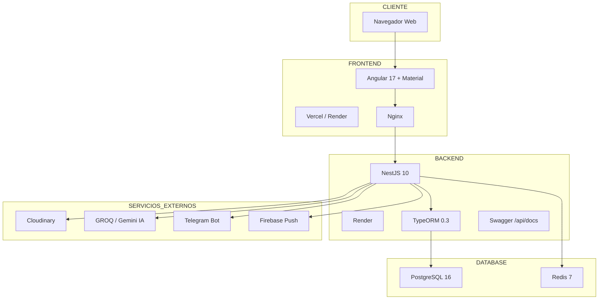
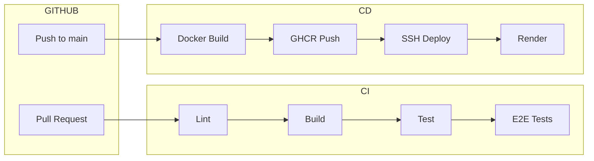
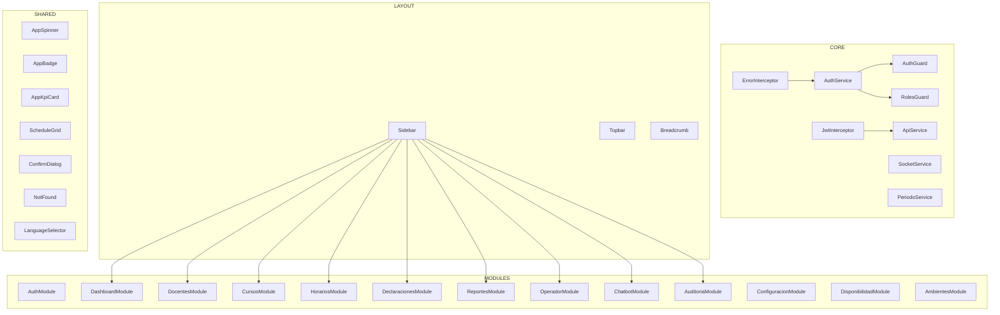
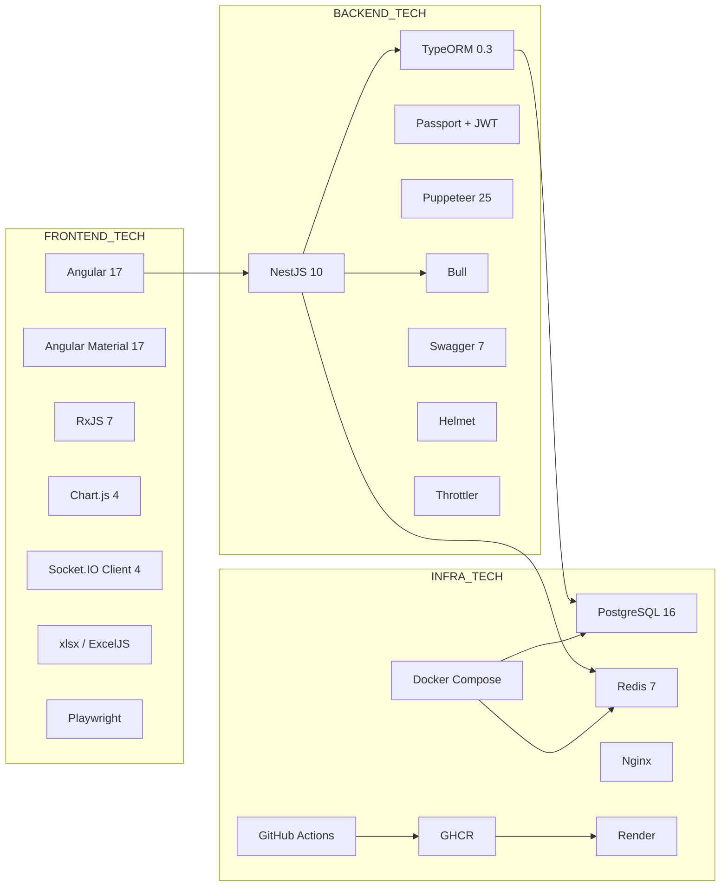

# Diagrama de Arquitectura — Sistema de Horarios Académicos UNT

| Campo | Valor |
|-------|-------|
| **Versión** | 1.0.0 |
| **Fecha** | 10/07/2026 |
| **Autor** | Equipo de Desarrollo — Escuela de Ingeniería de Sistemas, UNT |
| **Estado** | Revisado |

---

## 1. Descripción general

El **Sistema de Horarios Académicos UNT** sigue una arquitectura de capas (N-tier) con separación clara entre presentación, lógica de negocio y persistencia. El frontend está desacoplado del backend mediante una API RESTful documentada con Swagger, y ambos se comunican a través de HTTP/HTTPS con autenticación JWT.

### Stack tecnológico

| Capa | Tecnología | Versión |
|------|-----------|---------|
| Frontend | Angular | 17 |
| UI Components | Angular Material | 17 |
| Backend | NestJS | 10 |
| ORM | TypeORM | 0.3 |
| Base de datos | PostgreSQL | 16 |
| Cache / Colas | Redis | 7 (Bull) |
| WebSocket | Socket.IO | 4 |
| PDF Generation | Puppeteer | 25 |
| API Docs | Swagger | 7.x |
| Containerización | Docker Compose | — |
| CI/CD | GitHub Actions | — |

### Principios arquitectónicos

- **Separación de responsabilidades:** Controllers → Services → Repositories (TypeORM).
- **Módulos independientes:** Cada dominio (docentes, cursos, horarios, declaraciones, etc.) encapsula su controller, service, entity y DTOs.
- **Guards globales:** JWT + Roles para autorización a nivel endpoint.
- **Cache distribuido:** Redis para TTL de consultas frecuentes y colas Bull para tareas asíncronas.
- **Lazy loading:** Frontend carga módulos bajo demanda mediante rutas hijas.
- **Infrastructure as Code:** Docker Compose para entorno local; Dockerfiles multi-stage para producción.

---

## 2. Despliegue de infraestructura

### Descripción de cada capa

#### Cliente
Navegador web del usuario. No requiere instalación; la aplicación se accede vía URL. Compatible con Chrome, Firefox y Edge (últimas 2 versiones).

#### Frontend
Angular 17 + Angular Material servido por Nginx. Desplegado en Render (o Vercel para SPA estática). La imagen Docker utiliza un multi-stage build: primero compila con Node.js 22, luego sirve los assets estáticos con Nginx. La URL del API backend se inyecta en tiempo de compilación vía variable `API_URL` en `environment.prod.ts`.

#### Backend
NestJS 10 + Node.js 22, desplegado en Render como servicio web. Incluye Swagger habilitado en `/api/docs` para documentación interactiva de la API. Puppeteer ejecuta Chromium dentro del contenedor para generación de PDFs (horarios, reportes). El contenedor usa `dumb-init` como PID 1 y corre con un usuario no-root (`nestjs`).

#### Base de datos
- **PostgreSQL 16:** Almacena la información académica (docentes, cursos, ambientes, horarios, declaraciones, etc.). Se ejecuta como servicio Docker con healthcheck (`pg_isready`). El esquema se sincroniza automáticamente en desarrollo vía `synchronize: true` de TypeORM.
- **Redis 7:** Cache distribuido con TTL configurable (default 300s) y backend para colas Bull (tareas asíncronas: notificaciones push, generación de reportes). Se ejecuta como servicio Docker con healthcheck (`redis-cli ping`).

#### Servicios externos
- **Cloudinary:** Almacenamiento y transformación de imágenes (logos institucionales, fotos de perfil).
- **GROQ / Gemini IA:** Asistente conversacional (chatbot) para consultas sobre horarios y reglamentos académicos.
- **Telegram Bot:** Notificaciones proactivas a docentes sobre cambios de horario, asignaciones y mensajes del sistema.
- **Firebase Cloud Messaging:** Notificaciones push al navegador (alertas en tiempo real, actualizaciones de estado de declaraciones).

---

## 3. Flujo de CI/CD

### Pipeline ci.yml (Integración Continua)

Se ejecuta en cada `push` y `pull_request` hacia `main` o `develop`. Contiene tres jobs independientes:

1. **Backend CI:**
   - Levanta servicios PostgreSQL 15 y Redis 7 como contenedores de GitHub Actions.
   - Instala dependencias con `npm ci`.
   - Ejecuta `lint` (ESLint + Prettier).
   - Ejecuta `build` (NestJS compiler).
   - Sincroniza el esquema de BD con `ts-node test/sync-db.ts`.
   - Ejecuta tests unitarios e integrados con cobertura (`jest --coverage`).
   - Sube el reporte de cobertura como artifact.

2. **Frontend CI:**
   - Instala dependencias con `npm ci`.
   - Ejecuta `build` (Angular CLI, configuration production).
   - Ejecuta tests unitarios headless (`ChromeHeadless`).
   - Sube el reporte de cobertura como artifact.

3. **E2E Tests (Playwright):**
   - Depende de Backend CI y Frontend CI (se ejecuta solo si ambos pasan).
   - Levanta PostgreSQL + Redis, sincroniza esquema y ejecuta seed.
   - Inicia el backend en background y espera a que esté listo.
   - Ejecuta tests E2E con Playwright (proyecto Chromium).
   - Sube el reporte de Playwright como artifact (retención 30 días).

### Pipeline deploy.yml (Despliegue Continuo)

Se ejecuta al hacer `push` a `main`:

1. **Build and Push:**
   - Configura Docker Buildx para compilación multi-platform.
   - Autentica en GHCR (GitHub Container Registry).
   - Construye imágenes Docker de backend y frontend.
   - Pushea imágenes a GHCR con tags `latest` y SHA del commit.

2. **Deploy via SSH:**
   - Depende de build-and-push.
   - Conecta al servidor vía SSH.
   - Realiza `docker-compose pull` para obtener las nuevas imágenes.
   - Ejecuta `docker-compose up -d` para reiniciar los servicios.

### Pipeline pr-check.yml (Validación de PRs)

Se ejecuta en cada `pull_request` hacia `develop`:

1. **Branch Name:** Valida que el nombre de la rama siga el patrón `feature/*` o `hotfix/*`.
2. **Build Check:** Instala dependencias y compila backend y frontend.
3. **Notify Build Failure:** Si el build falla, comenta automáticamente en el PR indicando el error.

---

## 4. Arquitectura de componentes del backend

```mermaid
flowchart TD
    subgraph CONTROLLERS
        Auth[AuthController]
        Docentes[DocentesController]
        Cursos[CursosController]
        Ambientes[AmbientesController]
        Horarios[HorariosController]
        Declaraciones[DeclaracionesController]
        Reportes[ReportesController]
        Dashboard[DashboardController]
        Ventanas[VentanasController]
        Notificaciones[NotificacionesController]
        Chatbot[ChatbotController]
        Auditoria[AuditoriaController]
        Periodos[PeriodosController]
        Configuracion[ConfiguracionController]
        Facultades[FacultadesController]
        Usuarios[UsuariosController]
    end

    subgraph SERVICES
        AuthService[AuthService]
        DocentesService[DocentesService]
        CursosService[CursosService]
        HorariosService[HorariosService]
        DeclaracionesService[DeclaracionesService]
        ReportesService[ReportesService]
        NotificacionesService[NotificacionesService]
        VentanasService[VentanasService]
        ChatbotService[ChatbotService]
        AuditoriaService[AuditoriaService]
        PeriodosService[PeriodosService]
        ConfiguracionService[ConfiguracionService]
        GeneracionService[GeneracionAutomaticaService]
    end

    subgraph GUARDS
        JwtGuard[JwtAuthGuard]
        RolesGuard[RolesGuard]
        ThrottlerGuard[ThrottlerGuard]
    end

    subgraph DATABASE_LAYER
        TypeORMLayer[TypeORM]
        PostgreSQLLayer[PostgreSQL]
        RedisCache[Redis Cache]
        BullQueues[Bull Queues]
    end

    Auth --> AuthService
    Docentes --> DocentesService
    Cursos --> CursosService
    Horarios --> HorariosService
    Declaraciones --> DeclaracionesService
    Reportes --> ReportesService
    Notificaciones --> NotificacionesService
    Ventanas --> VentanasService
    Chatbot --> ChatbotService
    Auditoria --> AuditoriaService
    Periodos --> PeriodosService
    Configuracion --> ConfiguracionService

    AuthService --> JwtGuard
    DocentesService --> RolesGuard
    HorariosService --> RolesGuard

    DocentesService --> TypeORMLayer
    HorariosService --> TypeORMLayer
    CursosService --> TypeORMLayer
    DeclaracionesService --> TypeORMLayer
    ReportesService --> TypeORMLayer
    AuditoriaService --> TypeORMLayer
    NotificacionesService --> RedisCache
    NotificacionesService --> BullQueues
    HorariosService --> GeneracionService
    TypeORMLayer --> PostgreSQLLayer
```

### Controllers — Endpoints principales

| Controller | Prefijo | Responsabilidad |
|-----------|---------|-----------------|
| `AuthController` | `/auth` | Login JWT, verificación de token, refresh |
| `DocentesController` | `/docentes` | CRUD docentes, carga lectiva, horarios propios |
| `CursosController` | `/cursos` | CRUD cursos + detalle (info, ambientes, grupos) |
| `AmbientesController` | `/ambientes` | CRUD ambientes (aulas, laboratorios) |
| `HorariosController` | `/horarios` | Grilla de horarios, asignación, conflictos, gestión |
| `DeclaracionesController` | `/declaraciones` | Declaración de carga horaria (borrador → enviado → departamento → facultad → cerrado) |
| `ReportesController` | `/reportes` | Generación de PDFs y Excel (horarios, docentes, gestión) |
| `DashboardController` | `/dashboard` | KPIs, métricas de carga, gráficos, top docentes |
| `VentanasController` | `/operador/ventanas` | Sistema de turnos + WebSocket en tiempo real |
| `NotificacionesController` | `/notificaciones` | CRUD notificaciones, preferencias, push |
| `ChatbotController` | `/chatbot` | Asistente IA (GROQ/Gemini) |
| `AuditoriaController` | `/auditoria` | Trazabilidad de cambios en carga académica |
| `PeriodosController` | `/periodos` | Gestión de períodos académicos |
| `ConfiguracionController` | `/configuracion` | Parámetros generales, restricciones, carga lectiva |
| `FacultadesController` | `/facultades` | Facultades y departamentos |
| `UsuariosController` | `/usuarios` | Gestión de usuarios del sistema |

### Services — Servicios de negocio

| Service | Responsabilidad |
|---------|-----------------|
| `AuthService` | Autenticación JWT, validación de credenciales, verificación de token |
| `DocentesService` | CRUD docentes, validación de acceso (assertAccesoDocente), DNI |
| `CursosService` | CRUD cursos, detalle con ambientes y grupos |
| `HorariosService` | Asignación de horarios, verificación de ocupación, mis-horarios |
| `GeneracionAutomaticaService` | Generación automática de horarios por algoritmo |
| `DeclaracionesService` | Flujo completo de declaraciones de carga horaria |
| `ReportesService` | Generación de PDFs (Puppeteer) y Excel (ExcelJS) |
| `NotificacionesService` | Gestión de notificaciones in-app y preferencias |
| `TelegramBotService` | Integración con Telegram para notificaciones proactivas |
| `FirebasePushService` | Envío de notificaciones push al navegador |
| `VentanasService` | Gestión de turnos (ventanas) de atención |
| `ChatbotService` | Integración con GROQ/Gemini para asistente IA |
| `AuditoriaService` | Registro de trazabilidad de cambios en carga académica |
| `PeriodosService` | CRUD períodos académicos |
| `ConfiguracionService` | Parámetros globales del sistema |

### Guards — Autorización

| Guard | Nivel | Función |
|-------|-------|---------|
| `ThrottlerGuard` | Global | Rate limiting (100 req/min) — protege contra abuso |
| `JwtAuthGuard` | Global | Verifica JWT en todos los endpoints excepto los marcados como públicos |
| `RolesGuard` | Endpoint | Valida que el rol del usuario esté autorizado para el endpoint |

### Database Layer

- **TypeORM:** ORM con `autoLoadEntities: true`. Entidades declaradas como decoradores en cada módulo. Sincronización automática en desarrollo (`synchronize: true`).
- **PostgreSQL 16:** Base de datos relacional principal. Timezone configurado a `-05:00` (Perú). Soporte SSL opcional.
- **Redis Cache:** Cache distribuido con `cache-manager` y store Redis. TTL configurable por endpoint.
- **Bull Queues:** Colas de procesamiento asíncrono: generación de reportes PDF, envío de notificaciones push, sincronización de datos externos.

---

## 5. Arquitectura del frontend

### Módulos del frontend

#### Core (`core/`)
Capa transversal que contiene servicios, guards e interceptores compartidos por todos los módulos:

| Componente | Función |
|-----------|---------|
| `AuthService` | Manejo de JWT (login, logout, token storage, verificación de expiración) |
| `ApiService` | Wrapper de HttpClient con interceptores de JWT y error |
| `AuthGuard` | Protección de rutas: redirige a login si no hay token válido |
| `RolesGuard` | Protección por rol: deniega acceso si el usuario no tiene el rol requerido |
| `JwtInterceptor` | Inyecta header `Authorization: Bearer <token>` en cada petición HTTP |
| `ErrorInterceptor` | Captura errores HTTP (401 → logout, 403 → denegado, 500 → notificación) |
| `SocketService` | Conexión WebSocket (Socket.IO) para actualizaciones en tiempo real |
| `PeriodoService` | Período académico activo, selección de contexto |

#### Layout (`layout/`)
Estructura visual de la aplicación:

- **Sidebar:** Navegación lateral responsive con menú agrupado por secciones (Gestión Académica, Horarios, Sistema). Colapsable en móvil.
- **Topbar:** Barra superior con avatar del usuario, selector de idioma (es/en/pt), notificaciones y cerrar sesión.
- **Breadcrumb:** Navegación de migas de pan basada en la ruta actual.

#### Módulos de aplicación (`modules/`)

| Módulo | Ruta | Responsabilidad |
|--------|------|-----------------|
| `AuthModule` | `/login` | Formulario de login, cambio de contraseña obligatorio |
| `DashboardModule` | `/app/dashboard` | Panel principal con KPIs, gráficos de carga, funnel de estados, top docentes |
| `DocentesModule` | `/app/docentes` | CRUD docentes, búsqueda, filtros, gestión de carga lectiva |
| `CursosModule` | `/app/cursos` | CRUD cursos con tabs: Información, Ambientes, Grupos |
| `HorariosModule` | `/app/horarios` | Grilla semanal de horarios, asignación de bloques, detección de conflictos |
| `DeclaracionesModule` | `/app/declaraciones` | Flujo de declaraciones de carga horaria (5 estados), drag-and-drop de bloques no lectivos |
| `ReportesModule` | `/app/reportes` | Generación de reportes PDF/Excel: horarios, docentes, gestión, cumplimiento |
| `OperadorModule` | `/app/operador` | Sistema de turnos (ventanas), WebSocket en tiempo real, drag-and-drop de asignaciones |
| `ChatbotModule` | `/app/chatbot` | Asistente IA para consultas sobre horarios y reglamentos |
| `AuditoriaModule` | `/app/auditoria` | Trazabilidad de cambios (horarios + carga académica), filtros avanzados |
| `ConfiguracionModule` | `/app/configuracion` | Parámetros generales, restricciones, período activo |
| `DisponibilidadModule` | `/app/disponibilidad` | Grilla de disponibilidad semanal por docente |
| `AmbientesModule` | `/app/ambientes` | CRUD ambientes (aulas, laboratorios, salas) |

#### Componentes compartidos (`shared/`)

| Componente | Función |
|-----------|---------|
| `AppSpinner` | Indicador de carga global (overlay con animación) |
| `AppBadge` | Etiqueta de estado con color (PENDIENTE, CONFIRMADO, CERRADO, etc.) |
| `AppKpiCard` | Tarjeta de indicador clave (número + tendencia + icono) |
| `ScheduleGrid` | Grilla semanal reutilizable para visualización de horarios |
| `ConfirmDialog` | Diálogo de confirmación genérico (reemplaza `window.confirm`) |
| `NotFound` | Página 404 personalizada |
| `LanguageSelector` | Selector de idioma (español, inglés, portugués) |

---

## 6. Resumen de tecnologías

---

*Documento generado el 10/07/2026. Última actualización: Fase 12 — Seed y Base de Datos.*
