# Modelo de Datos — Sistema de Horarios Académicos UNT

| Campo        | Valor                                                            |
|--------------|------------------------------------------------------------------|
| **Versión**  | 1.0.0                                                            |
| **Fecha**    | 10/07/2026                                                       |
| **Autor**    | Equipo de Desarrollo — Escuela de Ingeniería de Sistemas, UNT    |
| **Estado**   | Revisado                                                         |

---

## 1. Descripción general

El sistema utiliza **PostgreSQL 16** como motor de almacenamiento, accedido mediante **TypeORM 0.3** en modo `synchronize: true` para entornos de desarrollo. Todas las fechas y horas se almacenan en la zona horaria **`-05:00`** (hora estándar de Perú).

El modelo de datos comprende:

| Aspecto            | Cantidad |
|--------------------|----------|
| Entidades TypeORM  | 42       |
| Enums              | 23       |
| Valores en enums   | 117      |

Las relaciones entre entidades siguen la normativa académica de la Universidad Nacional de Trujillo, cubriendo la jerarquía institucional (facultad → escuela → departamento), la gestión de docentes, cursos, ambientes, horarios, declaraciones de carga y trazabilidad vía auditorías.

---

## 2. Diagrama ER

```mermaid
erDiagram
    USUARIO {
        int id PK
        string nombre
        string email UK
        string password_hash
        enum rol
        boolean activo
        boolean debe_cambiar_password
        string idioma
        int departamento_id FK
        int escuela_id FK
        int facultad_id FK
    }
    DOCENTE {
        int id PK
        string codigo UK
        string dni UK
        string nombres
        string apellidos
        string email UK
        enum categoria
        enum tipo_contrato
        enum tipo_docente
        enum modalidad
        boolean activo
        int horas_asignadas
        int usuario_id FK
        int departamento_id FK
        int facultad_id FK
    }
    CURSO {
        int id PK
        string codigo UK
        string nombre
        int creditos
        int horas_teoria
        int horas_practica
        int horas_laboratorio
        int ciclo
        boolean tiene_laboratorio
        boolean activo
        int departamento_id FK
    }
    AMBIENTE {
        int id PK
        string codigo UK
        string nombre
        enum tipo
        int capacidad
        int piso
        string pabellon
        enum estado
        boolean activo
    }
    GRUPO {
        int id PK
        string codigo
        string nombre
        enum tipo
        int ciclo
        int cupo_maximo
        int periodo_academico_id FK
        int curso_id FK
    }
    FACULTAD {
        int id PK
        string codigo UK
        string nombre
        boolean activo
        int coordinador_id FK
    }
    ESCUELA {
        int id PK
        string codigo UK
        string nombre
        boolean activo
        int facultad_id FK
        int coordinador_id FK
    }
    DEPARTAMENTO {
        int id PK
        string codigo UK
        string nombre
        boolean activo
        int escuela_id FK
        int coordinador_id FK
    }
    PERIODO_ACADEMICO {
        int id PK
        string codigo UK
        string nombre
        date fecha_inicio
        date fecha_fin
        enum estado
        boolean activo
        enum modo_asignacion
    }
    HORARIO_ASIGNADO {
        int id PK
        int docente_id FK
        int curso_id FK
        int grupo_id FK
        int ambiente_id FK
        string periodo
        int dia
        time hora_inicio
        time hora_fin
        enum tipo_clase
        enum estado
        enum origen
    }
    DECLARACION_CARGA_HORARIA {
        int id PK
        int docente_id FK
        int departamento_id FK
        int facultad_id FK
        int periodo_academico_id FK
        enum estado
        jsonb carga_no_lectiva
        int total_horas_lectivas
        int total_horas_no_lectivas
        int version
    }
    DECLARACION_JURADA {
        int id PK
        int declaracion_id FK
        int docente_id FK
        int periodo_id FK
        string tipo_declaracion
        jsonb contenido
        string estado
    }
    DECLARACION_OBSERVACION {
        int id PK
        int declaracion_id FK
        int usuario_id FK
        text observacion
        enum estado_origen
        enum estado_destino
        enum tipo
        boolean subsanada
    }
    ASIGNACION_LECTIVA {
        int id PK
        int docente_id FK
        int curso_plan_id FK
        int periodo_id FK
        int grupo_id FK
        enum tipo_clase
        string seccion
        int nro_alumnos
        decimal horas_asignadas
        enum estado
    }
    DISPONIBILIDAD_DOCENTE {
        int id PK
        int docente_id FK
        int dia_semana
        time hora_inicio
        time hora_fin
        boolean disponible
        string periodo_academico
    }
    VENTANA_ATENCION {
        uuid id PK
        string periodo
        date fecha
        string proposito
        time hora_inicio
        time hora_fin
        int intervalo_minutos
        enum estado
    }
    CONFLICTO_ASIGNACION {
        int id PK
        text descripcion
        string tipo_conflicto
        string periodo_academico
        boolean resuelto
        int docente_id FK
        int ambiente_id FK
    }
    CONFIGURACION_GENERAL {
        int id PK
        string nombre_institucional
        string logo_url
        string color_primario
        string color_secundario
    }
    RESTRICCION_INSTITUCIONAL {
        int id PK
        string tipo_restriccion
        jsonb valor
        string periodo_academico
        boolean activo
    }
    AUDITORIA_CARGA {
        uuid id PK
        enum entidad
        int entidad_id
        int usuario_id FK
        enum accion
        string estado_anterior
        string estado_nuevo
        jsonb datos_anteriores
        jsonb datos_nuevos
    }
    AUDITORIA_HORARIO {
        uuid id PK
        int horario_id FK
        int usuario_id FK
        string accion
        jsonb datos_anteriores
        jsonb datos_nuevos
    }
    CARGA_ADICIONAL {
        int id PK
        int declaracion_id FK
        int docente_id FK
        string dependencia
        string actividad
        int total_horas
    }
    ACTIVIDAD_NO_LECTIVA {
        int id PK
        int declaracion_id FK
        enum tipo
        string descripcion
        int horas_totales
    }
    HORARIO_NO_LECTIVO {
        int id PK
        int actividad_id FK
        smallint dia
        time hora_inicio
        time hora_fin
    }

    USUARIO ||--o| DEPARTAMENTO : "pertenecedept"
    USUARIO ||--o| ESCUELA : "perteneceesc"
    USUARIO ||--o| FACULTAD : "pertenecefac"
    DOCENTE ||--o| USUARIO : "tiene_usuario"
    DOCENTE }o--|| DEPARTAMENTO : "trabaja_en"
    DOCENTE }o--|| FACULTAD : "pertenece_fac"
    DOCENTE ||--o{ DISPONIBILIDAD_DOCENTE : "tiene_disponibilidad"
    DOCENTE ||--o{ HORARIO_ASIGNADO : "tiene_horarios"
    DOCENTE ||--o{ ASIGNACION_LECTIVA : "tiene_asignaciones"
    DOCENTE ||--o{ DECLARACION_JURADA : "tiene_juradas"
    DOCENTE ||--o{ CARGA_ADICIONAL : "tiene_carga_adic"
    DOCENTE ||--o{ DECLARACION_CARGA_HORARIA : "tiene_declaraciones"
    CURSO ||--o{ GRUPO : "tiene_grupos"
    CURSO ||--o{ HORARIO_ASIGNADO : "se_imparte_en"
    CURSO }o--|| DEPARTAMENTO : "pertece_dpto"
    AMBIENTE ||--o{ HORARIO_ASIGNADO : "se_ocupa_en"
    GRUPO ||--o{ HORARIO_ASIGNADO : "tiene_horarios"
    PERIODO_ACADEMICO ||--o{ HORARIO_ASIGNADO : "del_periodo"
    PERIODO_ACADEMICO ||--o{ ASIGNACION_LECTIVA : "del_periodo"
    PERIODO_ACADEMICO ||--o{ VENTANA_ATENCION : "del_periodo"
    DECLARACION_CARGA_HORARIA ||--o{ DECLARACION_OBSERVACION : "tiene_observaciones"
    DECLARACION_CARGA_HORARIA ||--o{ DECLARACION_JURADA : "genera_juradas"
    DECLARACION_CARGA_HORARIA ||--o{ CARGA_ADICIONAL : "tiene_cargas"
    DECLARACION_CARGA_HORARIA ||--o{ ACTIVIDAD_NO_LECTIVA : "tiene_actividades"
    ACTIVIDAD_NO_LECTIVA ||--o{ HORARIO_NO_LECTIVO : "tiene_horarios"
    FACULTAD ||--o{ ESCUELA : "tiene_escuelas"
    ESCUELA ||--o{ DEPARTAMENTO : "tiene_departamentos"
    CONFLICTO_ASIGNACION }o--o| DOCENTE : "conflicto_doc"
    CONFLICTO_ASIGNACION }o--o| AMBIENTE : "conflicto_amb"
    AUDITORIA_CARGA }o--|| USUARIO : "auditado_por"
    AUDITORIA_HORARIO }o--|| HORARIO_ASIGNADO : "auditado_horario"
```



---

## 3. Tabla de entidades detallada

### 3.1. USUARIO — Sistema de autenticación

| Campo                    | Tipo    | Descripción                                     |
|--------------------------|---------|-------------------------------------------------|
| `id`                     | int PK  | Identificador único                             |
| `nombre`                 | string  | Nombre completo                                 |
| `email`                  | string UK | Correo institucional (login)                  |
| `password_hash`          | string  | Hash bcrypt de la contraseña                    |
| `rol`                    | enum    | Rol del usuario (`RolUsuario`)                  |
| `activo`                 | boolean | Si el usuario puede acceder al sistema          |
| `debe_cambiar_password`  | boolean | Forzar cambio de contraseña en primer ingreso   |
| `idioma`                 | string  | Idioma de la interfaz (`es`, `en`, `pt`)        |
| `departamento_id`        | int FK  | Departamento asociado                           |
| `escuela_id`             | int FK  | Escuela asociada                                |
| `facultad_id`            | int FK  | Facultad asociada                               |

### 3.2. DOCENTE — Información académica del docente

| Campo               | Tipo    | Descripción                                        |
|---------------------|---------|----------------------------------------------------|
| `id`                | int PK  | Identificador único                                |
| `codigo`            | string UK | Código institucional del docente                  |
| `dni`               | string UK | Número de documento de identidad                   |
| `nombres`           | string  | Nombres                                             |
| `apellidos`         | string  | Apellidos                                           |
| `email`             | string UK | Correo electrónico                                 |
| `categoria`         | enum    | Categoría docente (`CategoriaDocente`)             |
| `tipo_contrato`     | enum    | Tipo de contrato (`TipoContrato`)                  |
| `tipo_docente`      | enum    | Tipo de docente (`TipoDocente`)                    |
| `modalidad`         | enum    | Modalidad de dedicación (`ModalidadDocente`)       |
| `activo`            | boolean | Si el docente está activo en el sistema            |
| `horas_asignadas`   | int     | Total de horas asignadas en el periodo             |
| `usuario_id`        | int FK  | Cuenta de usuario asociada                         |
| `departamento_id`   | int FK  | Departamento al que pertenece                      |
| `facultad_id`       | int FK  | Facultad a la que pertenece                        |

### 3.3. CURSO — Materia o asignatura

| Campo                 | Tipo    | Descripción                                    |
|-----------------------|---------|------------------------------------------------|
| `id`                  | int PK  | Identificador único                            |
| `codigo`              | string UK | Código único del curso                        |
| `nombre`              | string  | Nombre de la materia                           |
| `creditos`            | int     | Número de créditos                             |
| `horas_teoria`        | int     | Horas semanales de teoría                      |
| `horas_practica`      | int     | Horas semanales de práctica                    |
| `horas_laboratorio`   | int     | Horas semanales de laboratorio                 |
| `ciclo`               | int     | Ciclo curricular (1–10)                        |
| `tiene_laboratorio`   | boolean | Si el curso requiere laboratorio               |
| `activo`              | boolean | Si el curso está vigente                       |
| `departamento_id`     | int FK  | Departamento que ofrece el curso               |

### 3.4. AMBIENTE — Espacio físico

| Campo          | Tipo    | Descripción                                       |
|----------------|---------|---------------------------------------------------|
| `id`           | int PK  | Identificador único                               |
| `codigo`       | string UK | Código del ambiente                              |
| `nombre`       | string  | Nombre descriptivo                                |
| `tipo`         | enum    | Tipo de ambiente (`TipoAmbiente`)                 |
| `capacidad`    | int     | Número máximo de estudiantes                      |
| `piso`         | int     | Ubicación en piso                                 |
| `pabellon`     | string  | Pabellón o edificio                               |
| `estado`       | enum    | Estado operativo (`EstadoAmbiente`)               |
| `activo`       | boolean | Si el ambiente está disponible para uso           |

### 3.5. GRUPO — Sección dentro de un curso

| Campo                   | Tipo    | Descripción                                    |
|-------------------------|---------|------------------------------------------------|
| `id`                    | int PK  | Identificador único                            |
| `codigo`                | string  | Código del grupo (ej. `A`, `B`)                |
| `nombre`                | string  | Nombre del grupo                               |
| `tipo`                  | enum    | Tipo de grupo                                  |
| `ciclo`                 | int     | Ciclo del grupo                                |
| `cupo_maximo`           | int     | Cupo máximo de estudiantes                     |
| `periodo_academico_id`  | int FK  | Periodo académico al que pertenece             |
| `curso_id`              | int FK  | Curso asociado                                 |

### 3.6. FACULTAD, ESCUELA, DEPARTAMENTO — Jerarquía organizacional

#### FACULTAD

| Campo             | Tipo    | Descripción                              |
|-------------------|---------|------------------------------------------|
| `id`              | int PK  | Identificador único                      |
| `codigo`          | string UK | Código de la facultad                   |
| `nombre`          | string  | Nombre de la facultad                    |
| `activo`          | boolean | Si la facultad está vigente              |
| `coordinador_id`  | int FK  | Docente coordinador                      |

#### ESCUELA

| Campo             | Tipo    | Descripción                              |
|-------------------|---------|------------------------------------------|
| `id`              | int PK  | Identificador único                      |
| `codigo`          | string UK | Código de la escuela                    |
| `nombre`          | string  | Nombre de la escuela                     |
| `activo`          | boolean | Si la escuela está vigente               |
| `facultad_id`     | int FK  | Facultad a la que pertenece              |
| `coordinador_id`  | int FK  | Docente coordinador                      |

#### DEPARTAMENTO

| Campo             | Tipo    | Descripción                              |
|-------------------|---------|------------------------------------------|
| `id`              | int PK  | Identificador único                      |
| `codigo`          | string UK | Código del departamento                 |
| `nombre`          | string  | Nombre del departamento                  |
| `activo`          | boolean | Si el departamento está vigente          |
| `escuela_id`      | int FK  | Escuela a la que pertenece               |
| `coordinador_id`  | int FK  | Docente coordinador                      |

### 3.7. PERIODO_ACADEMICO — Periodo académico

| Campo               | Tipo    | Descripción                                      |
|---------------------|---------|--------------------------------------------------|
| `id`                | int PK  | Identificador único                              |
| `codigo`            | string UK | Código del periodo (ej. `2026-I`)               |
| `nombre`            | string  | Nombre descriptivo                               |
| `fecha_inicio`      | date    | Fecha de inicio                                  |
| `fecha_fin`         | date    | Fecha de fin                                     |
| `estado`            | enum    | Estado del periodo (`EstadoPeriodo`)             |
| `activo`            | boolean | Si es el periodo vigente                         |
| `modo_asignacion`   | enum    | Modo de asignación de horarios (`ModoAsignacion`)|

### 3.8. HORARIO_ASIGNADO — Bloque de horario asignado

| Campo                | Tipo    | Descripción                                      |
|----------------------|---------|--------------------------------------------------|
| `id`                 | int PK  | Identificador único                              |
| `docente_id`         | int FK  | Docente asignado                                 |
| `curso_id`           | int FK  | Curso que se imparte                             |
| `grupo_id`           | int FK  | Grupo al que pertenece                           |
| `ambiente_id`        | int FK  | Ambiente donde se imparte                        |
| `periodo`            | string  | Periodo académico                                |
| `dia`                | int     | Día de la semana (1=Lunes, 7=Domingo)            |
| `hora_inicio`        | time    | Hora de inicio del bloque                        |
| `hora_fin`           | time    | Hora de fin del bloque                           |
| `tipo_clase`         | enum    | Tipo de clase (`TipoClase`)                      |
| `estado`             | enum    | Estado del horario (`EstadoHorario`)             |
| `origen`             | enum    | Cómo se generó (`OrigenHorario`)                 |

### 3.9. DECLARACION_CARGA_HORARIA — Declaración de carga horaria

| Campo                      | Tipo    | Descripción                                    |
|----------------------------|---------|------------------------------------------------|
| `id`                       | int PK  | Identificador único                            |
| `docente_id`               | int FK  | Docente titular                                |
| `departamento_id`          | int FK  | Departamento responsable                       |
| `facultad_id`              | int FK  | Facultad supervisora                           |
| `periodo_academico_id`     | int FK  | Periodo académico                              |
| `estado`                   | enum    | Estado de la declaración (`EstadoDeclaracionCarga`) |
| `carga_no_lectiva`         | jsonb   | Detalle de actividades no lectivas (JSON)      |
| `total_horas_lectivas`     | int     | Total de horas lectivas                        |
| `total_horas_no_lectivas`  | int     | Total de horas no lectivas                     |
| `version`                  | int     | Número de versión (control de concurrencia)    |

### 3.10. DECLARACION_JURADA — Documento jurado

| Campo                | Tipo    | Descripción                                      |
|----------------------|---------|--------------------------------------------------|
| `id`                 | int PK  | Identificador único                              |
| `declaracion_id`     | int FK  | Declaración de carga asociada                    |
| `docente_id`         | int FK  | Docente declarante                               |
| `periodo_id`         | int FK  | Periodo académico                                |
| `tipo_declaracion`   | string  | Tipo de declaración jurada                       |
| `contenido`          | jsonb   | Contenido del documento (JSON)                   |
| `estado`             | string  | Estado de la jurada                              |

### 3.11. DECLARACION_OBSERVACION — Observación sobre declaración

| Campo               | Tipo    | Descripción                                      |
|---------------------|---------|--------------------------------------------------|
| `id`                | int PK  | Identificador único                              |
| `declaracion_id`    | int FK  | Declaración observada                            |
| `usuario_id`        | int FK  | Usuario que registra la observación              |
| `observacion`       | text    | Texto de la observación                          |
| `estado_origen`     | enum    | Estado de origen (`EstadoDeclaracionCarga`)      |
| `estado_destino`    | enum    | Estado de destino (`EstadoDeclaracionCarga`)     |
| `tipo`              | enum    | Tipo de observación (`TipoObservacion`)          |
| `subsanada`         | boolean | Si la observación fue subsanada                  |

### 3.12. ASIGNACION_LECTIVA — Asignación de carga lectiva

| Campo             | Tipo    | Descripción                                        |
|-------------------|---------|----------------------------------------------------|
| `id`              | int PK  | Identificador único                                |
| `docente_id`      | int FK  | Docente asignado                                   |
| `curso_plan_id`   | int FK  | Curso del plan de estudios                         |
| `periodo_id`      | int FK  | Periodo académico                                  |
| `grupo_id`        | int FK  | Grupo asignado (nullable)                          |
| `tipo_clase`      | enum    | Tipo de clase (`TipoClase`)                        |
| `seccion`         | string  | Sección o paralela                                 |
| `nro_alumnos`     | int     | Número de alumnos inscritos                        |
| `horas_asignadas` | decimal | Horas semanales asignadas                          |
| `estado`          | enum    | Estado de la asignación (`EstadoAsignacionLectiva`)|

### 3.13. DISPONIBILIDAD_DOCENTE — Disponibilidad horaria

| Campo                 | Tipo    | Descripción                                    |
|-----------------------|---------|------------------------------------------------|
| `id`                  | int PK  | Identificador único                            |
| `docente_id`          | int FK  | Docente                                         |
| `dia_semana`          | int     | Día de la semana (1–7)                         |
| `hora_inicio`         | time    | Hora de inicio de disponibilidad               |
| `hora_fin`            | time    | Hora de fin de disponibilidad                  |
| `disponible`          | boolean | Si el docente está disponible en ese horario   |
| `periodo_academico`   | string  | Periodo académico                              |

### 3.14. VENTANA_ATENCION — Ventana de atención / turnos

| Campo               | Tipo    | Descripción                                    |
|---------------------|---------|------------------------------------------------|
| `id`                | uuid PK | Identificador único (UUID)                     |
| `periodo`           | string  | Periodo académico                              |
| `fecha`             | date    | Fecha de la ventana                            |
| `proposito`         | string  | Propósito de la ventana                        |
| `hora_inicio`       | time    | Hora de apertura                               |
| `hora_fin`          | time    | Hora de cierre                                 |
| `intervalo_minutos` | int     | Duración del intervalo (minutos)               |
| `estado`            | enum    | Estado de la ventana (`CategoriaVentana`)      |

### 3.15. CONFLICTO_ASIGNACION — Conflicto detectado

| Campo                 | Tipo    | Descripción                                    |
|-----------------------|---------|------------------------------------------------|
| `id`                  | int PK  | Identificador único                            |
| `descripcion`         | text    | Descripción del conflicto                      |
| `tipo_conflicto`      | string  | Tipo de conflicto (`TipoConflicto`)            |
| `periodo_academico`   | string  | Periodo académico                              |
| `resuelto`            | boolean | Si el conflicto fue resuelto                   |
| `docente_id`          | int FK  | Docente involucrado (nullable)                 |
| `ambiente_id`         | int FK  | Ambiente involucrado (nullable)                |

### 3.16. CONFIGURACION_GENERAL — Parámetros institucionales

| Campo                       | Tipo   | Descripción                          |
|-----------------------------|--------|--------------------------------------|
| `id`                        | int PK | Identificador único                  |
| `nombre_institucional`      | string | Nombre de la institución             |
| `logo_url`                  | string | URL del logo institucional           |
| `color_primario`            | string | Color primario (hex)                 |
| `color_secundario`          | string | Color secundario (hex)               |

### 3.17. RESTRICCION_INSTITUCIONAL — Restricciones configurables

| Campo                | Tipo    | Descripción                                    |
|----------------------|---------|------------------------------------------------|
| `id`                 | int PK  | Identificador único                            |
| `tipo_restriccion`   | string  | Tipo de restricción                            |
| `valor`              | jsonb   | Valor de la restricción (JSON)                 |
| `periodo_academico`  | string  | Periodo académico aplicable                    |
| `activo`             | boolean | Si la restricción está vigente                 |

### 3.18. AUDITORIA_CARGA — Registro de auditoría de carga

| Campo               | Tipo    | Descripción                                      |
|---------------------|---------|--------------------------------------------------|
| `id`                | uuid PK | Identificador único (UUID)                       |
| `entidad`           | enum    | Entidad auditada (`EntidadAuditoriaCarga`)       |
| `entidad_id`        | int     | ID de la entidad auditada                        |
| `usuario_id`        | int FK  | Usuario que realizó la acción                    |
| `accion`            | enum    | Acción realizada (`AccionAuditoriaCarga`)        |
| `estado_anterior`   | string  | Estado previo                                    |
| `estado_nuevo`      | string  | Estado posterior                                 |
| `datos_anteriores`  | jsonb   | Datos previos (JSON)                             |
| `datos_nuevos`      | jsonb   | Datos posteriores (JSON)                         |

### 3.19. AUDITORIA_HORARIO — Registro de auditoría de horarios

| Campo               | Tipo    | Descripción                                      |
|---------------------|---------|--------------------------------------------------|
| `id`                | uuid PK | Identificador único (UUID)                       |
| `horario_id`        | int FK  | Horario asignado auditado                        |
| `usuario_id`        | int FK  | Usuario que realizó la acción                    |
| `accion`            | string  | Acción realizada                                 |
| `datos_anteriores`  | jsonb   | Datos previos (JSON)                             |
| `datos_nuevos`      | jsonb   | Datos posteriores (JSON)                         |

### 3.20. CARGA_ADICIONAL — Carga lectiva adicional

| Campo              | Tipo    | Descripción                                    |
|--------------------|---------|------------------------------------------------|
| `id`               | int PK  | Identificador único                            |
| `declaracion_id`   | int FK  | Declaración de carga asociada                  |
| `docente_id`       | int FK  | Docente responsable                            |
| `dependencia`      | string  | Dependencia que solicita                       |
| `actividad`        | string  | Nombre de la actividad                         |
| `total_horas`      | int     | Total de horas semanales                       |

### 3.21. ACTIVIDAD_NO_LECTIVA — Actividad no lectiva

| Campo              | Tipo    | Descripción                                      |
|--------------------|---------|--------------------------------------------------|
| `id`               | int PK  | Identificador único                              |
| `declaracion_id`   | int FK  | Declaración de carga asociada                    |
| `tipo`             | enum    | Tipo de actividad (`TipoActividadNoLectiva`)     |
| `descripcion`      | string  | Descripción de la actividad                      |
| `horas_totales`    | int     | Total de horas semanales                         |

### 3.22. HORARIO_NO_LECTIVO — Horario de actividad no lectiva

| Campo            | Tipo    | Descripción                                    |
|------------------|---------|------------------------------------------------|
| `id`             | int PK  | Identificador único                            |
| `actividad_id`   | int FK  | Actividad no lectiva asociada                  |
| `dia`            | smallint| Día de la semana (1–7)                         |
| `hora_inicio`    | time    | Hora de inicio                                 |
| `hora_fin`       | time    | Hora de fin                                    |

---

## 4. Tabla de enums

### 4.1. TipoDependenciaClad

| Valor                | Descripción                      |
|----------------------|----------------------------------|
| `POSGRADO`          | Programa de posgrado             |
| `SEGUNDA_ESPECIALIDAD` | Segunda especialidad           |
| `CEPUNT`            | Centro de estudios PUNT          |
| `FILIAL`            | Sede filial                      |
| `CENTRO_PRODUCCION` | Centro de producción             |
| `OTRO`              | Otro tipo de dependencia         |

### 4.2. EstadoClad

| Valor                     | Descripción                              |
|---------------------------|------------------------------------------|
| `BORRADOR`               | En edición                               |
| `ENVIADO_DPTO`           | Enviado al departamento                  |
| `OBSERVADO_DPTO`         | Observado por el departamento            |
| `VALIDADO_DPTO`          | Validado por el departamento             |
| `OBSERVADO_DEPENDENCIA`  | Observado por la dependencia             |
| `VALIDADO_DEPENDENCIA`   | Validado por la dependencia              |
| `APROBADO_FINAL`         | Aprobado definitivamente                 |

### 4.3. TipoActividadNoLectiva

| Valor                       | Descripción                    |
|-----------------------------|--------------------------------|
| `PREPARACION_EVALUACION`   | Preparación de evaluaciones    |
| `INVESTIGACION`            | Actividad de investigación     |
| `TUTORIA`                  | Tutoría de estudiantes         |
| `GESTION_ACADEMICA`        | Gestión académica              |
| `PROYECCION_SOCIAL`        | Proyección social              |
| `CAPACITACION`             | Capacitación                   |
| `OTRA`                     | Otra actividad                 |

### 4.4. EstadoDeclaracionCarga

| Valor                    | Descripción                          |
|--------------------------|--------------------------------------|
| `BORRADOR`              | En edición por el docente            |
| `ENVIADO`               | Enviado para revisión                |
| `OBSERVADO_DPTO`        | Observado por el departamento        |
| `VALIDADO_DPTO`         | Validado por el departamento         |
| `OBSERVADO_FACULTAD`    | Observado por la facultad            |
| `APROBADO_FACULTAD`     | Aprobado por la facultad             |
| `CERRADO`               | Declaración cerrada                  |
| `REABIERTO`             | Reabierto tras cierre                |

### 4.5. TipoClase

| Valor         | Descripción                    |
|---------------|--------------------------------|
| `TEORIA`      | Clase teórica                  |
| `PRACTICA`    | Clase práctica                 |
| `LABORATORIO` | Clase de laboratorio           |
| `NO_LECTIVA`  | Actividad no lectiva           |

### 4.6. TipoObservacion

| Valor                 | Descripción                      |
|-----------------------|----------------------------------|
| `OBSERVACION_DPTO`   | Observación del departamento     |
| `OBSERVACION_FACULTAD`| Observación de la facultad      |

### 4.7. EstadoAsignacionLectiva

| Valor          | Descripción                      |
|----------------|----------------------------------|
| `PENDIENTE`    | Pendiente de confirmación        |
| `CONFIRMADO`   | Asignación confirmada            |
| `RECHAZADO`    | Asignación rechazada             |

### 4.8. TipoCursoPlan

| Valor                      | Descripción                          |
|----------------------------|--------------------------------------|
| `ESPECIALIDAD`             | Curso de especialidad                |
| `OBLIGATORIO_GENERAL`      | Obligatorio general                  |
| `OBLIGATORIO_PROFESIONAL`  | Obligatorio profesional              |
| `ELECTIVO`                 | Curso electivo                       |

### 4.9. TipoDocente

| Valor                        | Descripción                          |
|------------------------------|--------------------------------------|
| `ORDINARIO`                  | Docente ordinario                    |
| `CONTRATADO`                 | Docente contratado                   |
| `JEFE_PRACTICA_CONTRATADO`   | Jefe de práctica (contratado)        |

### 4.10. TipoContrato

| Valor          | Descripción                      |
|----------------|----------------------------------|
| `NOMBRADO`     | Nombrado (planta permanente)     |
| `CONTRATADO`   | Contratado (plazo determinado)   |

### 4.11. TipoConflicto

| Valor                      | Descripción                          |
|----------------------------|--------------------------------------|
| `SIN_DOCENTE`             | Sin docente asignado                 |
| `SIN_AMBIENTE`            | Sin ambiente disponible              |
| `CRUCE_DOCENTE`           | Cruce de horario del mismo docente   |
| `CRUCE_AMBIENTE`          | Cruce de horario del mismo ambiente  |
| `CRUCE_GRUPO`             | Cruce de horario del mismo grupo     |
| `CARGA_INSUFICIENTE`      | Carga horaria insuficiente           |
| `CARGA_EXCEDIDA`          | Carga horaria excedida               |
| `SIN_DISPONIBILIDAD`      | Docente sin disponibilidad           |
| `CAPACIDAD_INSUFICIENTE`  | Capacidad del ambiente excedida      |
| `DESCANSO_MINIMO`         | Descanso mínimo no respetado         |
| `FRANJA_INSTITUCIONAL`    | Franja institucional bloqueada       |
| `DIA_NO_LABORABLE`        | Día no laborable                     |

### 4.12. TipoAmbiente

| Valor              | Descripción                    |
|--------------------|--------------------------------|
| `AULA`             | Aula de clase                  |
| `LABORATORIO`      | Laboratorio                    |
| `AUDITORIO`        | Auditorio                      |
| `TALLER`           | Taller                         |
| `SEMINARIO`        | Sala de seminarios             |
| `SALA_COMPUTACION` | Sala de computación            |

### 4.13. RolUsuario

| Valor                       | Descripción                          |
|-----------------------------|--------------------------------------|
| `administradorsistema`      | Administrador del sistema            |
| `directorescuela`           | Director de escuela                  |
| `directordepartamento`      | Director de departamento             |
| `coordinadoracademico`      | Coordinador académico                |
| `decano`                    | Decano de facultad                   |
| `secretaria`                | Secretaria administrativa            |
| `operadorhorarios`          | Operador de horarios                 |
| `docente`                   | Docente                              |

### 4.14. OrigenHorario

| Valor                       | Descripción                          |
|-----------------------------|--------------------------------------|
| `generacion_automatica`     | Generado por el algoritmo automático |
| `ventana_atencion`          | Asignado en ventana de atención      |
| `ajuste_manual`             | Ajuste manual por operador           |
| `subsanacion`               | Subsanación de declaración           |

### 4.15. ModoAsignacion

| Valor          | Descripción                          |
|----------------|--------------------------------------|
| `automatica`   | Asignación 100% automática           |
| `ventanas`     | Asignación por ventanas de atención  |
| `mixta`        | Combinación de ambos modos           |

### 4.16. ModalidadDocente

| Valor                     | Descripción            | Máx. horas/semana |
|---------------------------|------------------------|--------------------|
| `DEDICACION_EXCLUSIVA`    | Dedicación exclusiva   | 48                 |
| `TIEMPO_COMPLETO_40`      | Tiempo completo 40h    | 40                 |
| `TIEMPO_PARCIAL_20`       | Tiempo parcial 20h     | 20                 |
| `TIEMPO_PARCIAL_12`       | Tiempo parcial 12h     | 12                 |
| `TIEMPO_PARCIAL_10`       | Tiempo parcial 10h     | 10                 |
| `TIEMPO_PARCIAL_8`        | Tiempo parcial 8h      | 8                  |

### 4.17. EstadoPeriodo

| Valor                | Descripción                          |
|----------------------|--------------------------------------|
| `planificacion`      | En planificación                     |
| `asignacionhorarios` | En asignación de horarios            |
| `encurso`            | En curso (periodo activo)            |
| `finalizado`         | Periodo finalizado                   |

### 4.18. EstadoHorario

| Valor          | Descripción                          |
|----------------|--------------------------------------|
| `BORRADOR`     | Horario en edición                   |
| `CONFIRMADO`   | Horario confirmado                   |
| `PUBLICADO`    | Horario publicado                    |
| `CONFLICTO`    | Presenta conflictos                  |
| `CERRADO`      | Periodo cerrado                      |

### 4.19. EstadoCampana

| Valor          | Descripción                          |
|----------------|--------------------------------------|
| `BORRADOR`     | Campaña en borrador                  |
| `GENERADO`     | Horarios generados                   |
| `PUBLICADO`    | Publicado para consulta              |
| `EN_CURSO`     | En curso                             |
| `CERRADO`      | Cerrado                              |
| `CANCELADO`    | Cancelado                            |

### 4.20. EstadoAmbiente

| Valor            | Descripción                          |
|------------------|--------------------------------------|
| `ACTIVO`         | Disponible para uso                  |
| `MANTENIMIENTO`  | En mantenimiento                     |
| `RESERVADO`      | Reservado para evento específico     |
| `INACTIVO`       | No disponible                        |

### 4.21. CategoriaVentana

| Valor            | Descripción                          |
|------------------|--------------------------------------|
| `DECLARACION`    | Ventana para declaración             |
| `SUBSANACION`    | Ventana para subsanación             |
| `CAMBIO`         | Ventana para cambio de horario       |
| `CONTINGENCIA`   | Ventana de contingencia              |

### 4.22. CategoriaDocente

| Valor               | Descripción                          |
|---------------------|--------------------------------------|
| `PRINCIPAL`         | Categoría principal                  |
| `ASOCIADO`          | Categoría asociado                   |
| `AUXILIAR`          | Categoría auxiliar                   |
| `SIN_CATEGORIA`     | Sin categoría asignada               |
| `JEFE_PRACTICA`     | Jefe de práctica                     |

### 4.23. EstadoCursoPlan

| Valor            | Descripción                          |
|------------------|--------------------------------------|
| `ACTIVO`         | Curso vigente en el plan             |
| `DESACTUALIZADO` | Curso desactualizado                 |
| `ELIMINADO`      | Curso eliminado del plan             |

---

## 5. Reglas de negocio

### 5.1. Carga horaria por modalidad

La `ModalidadDocente` determina el número máximo de horas semanales que un docente puede tener asignadas:

| Modalidad              | Máximo horas/semana |
|------------------------|---------------------|
| `DEDICACION_EXCLUSIVA` | 48                  |
| `TIEMPO_COMPLETO_40`   | 40                  |
| `TIEMPO_PARCIAL_20`    | 20                  |
| `TIEMPO_PARCIAL_12`    | 12                  |
| `TIEMPO_PARCIAL_10`    | 10                  |
| `TIEMPO_PARCIAL_8`     | 8                   |

El sistema valida que `horas_asignadas` del docente no exceda el máximo correspondiente a su modalidad.

### 5.2. Detección de conflictos

El sistema genera automáticamente un `CONFLICTO_ASIGNACION` cuando detecta cualquiera de las siguientes situaciones:

- **Cruce de docente** (`CRUCE_DOCENTE`): Un mismo docente tiene dos bloques asignados en el mismo día y horario superpuesto.
- **Cruce de ambiente** (`CRUCE_AMBIENTE`): Un mismo ambiente tiene dos bloques asignados en el mismo día y horario superpuesto.
- **Cruce de grupo** (`CRUCE_GRUPO`): Un mismo grupo tiene dos bloques asignados en el mismo día y horario superpuesto.
- **Sin docente** (`SIN_DOCENTE`): Un bloque fue creado sin asignar docente.
- **Sin ambiente** (`SIN_AMBIENTE`): Un bloque fue creado sin asignar ambiente.
- **Capacidad insuficiente** (`CAPACIDAD_INSUFICIENTE`): El número de alumnos del grupo excede la capacidad del ambiente.
- **Descanso mínimo** (`DESCANSO_MINIMO`): Un docente tiene bloques consecutivos sin un descanso mínimo de 30 minutos entre ellos.
- **Sin disponibilidad** (`SIN_DISPONIBILIDAD`): Un bloque se asigna fuera de la disponibilidad declarada por el docente.

### 5.3. Flujo de estados de declaración de carga

Las declaraciones de carga horaria transitan por un flujo lineal de 8 estados:

```
BORRADOR → ENVIADO → OBSERVADO_DPTO → VALIDADO_DPTO
  → OBSERVADO_FACULTAD → APROBADO_FACULTAD → CERRADO
                                            ↗ REABIERTO
```

| Transición               | Actor que ejecuta       | Acción                                   |
|--------------------------|-------------------------|------------------------------------------|
| BORRADOR → ENVIADO       | Docente                 | Envía declaración                        |
| ENVIADO → OBSERVADO_DPTO | Director de departamento | Observa / solicita corrección            |
| OBSERVADO_DPTO → ENVIADO | Docente                 | Subsana observación y reenvía            |
| ENVIADO → VALIDADO_DPTO  | Director de departamento | Valida y envía a facultad                |
| VALIDADO_DPTO → OBSERVADO_FACULTAD | Decano | Observa / solicita corrección   |
| OBSERVADO_FACULTAD → VALIDADO_DPTO | Director de depto | Devuelve con correcciones    |
| VALIDADO_DPTO → APROBADO_FACULTAD | Decano | Aprueba la declaración        |
| APROBADO_FACULTAD → CERRADO | Sistema | Se cierra automáticamente al finalizar periodo |
| CERRADO → REABIERTO | Administrador | Reabre para corrección excepcional      |

### 5.4. Flujo de estados de horario

Los horarios asignados transitan por un flujo de 3 estados principales:

```
BORRADOR → CONFIRMADO → PUBLICADO
    ↓                        ↓
 CONFLICTO               CERRADO
```

| Transición              | Actor que ejecuta    | Condición                                |
|-------------------------|----------------------|------------------------------------------|
| BORRADOR → CONFIRMADO   | Operador / Director  | Sin conflictos activos                   |
| CONFIRMADO → PUBLICADO  | Operador             | Horario aprobado por la institución      |
| BORRADOR → CONFLICTO    | Sistema              | Detección automática de conflictos       |
| CONFLICTO → BORRADOR    | Operador             | Resolución de conflictos                 |
| PUBLICADO → CERRADO     | Sistema              | Al finalizar el periodo académico        |

### 5.5. Restricciones institucionales

Las `RESTRICCION_INSTITUCIONAL` definen parámetros globales que el sistema valida al generar o asignar horarios:

| Restricción               | Valor por defecto | Descripción                                    |
|---------------------------|--------------------|------------------------------------------------|
| `duracion_bloque`         | 45 min             | Duración estándar de un bloque de clase         |
| `hora_inicio`             | 07:00              | Hora de inicio de la jornada académica          |
| `hora_fin`                | 22:00              | Hora de fin de la jornada académica             |
| `hora_almuerzo_inicio`    | 12:00              | Inicio del bloque de almuerzo                   |
| `hora_almuerzo_fin`       | 14:00              | Fin del bloque de almuerzo                      |
| `max_horas_por_dia`       | 8                  | Máximo de horas de clase por día por docente    |
| `descanso_minimo`         | 30 min             | Descanso mínimo entre bloques de un docente     |
| `dias_laborables`         | 1-6                | Días laborables (Lunes a Sábado)                |

Estas restricciones se almacenan en `RESTRICCION_INSTITUCIONAL.valor` como objetos JSON y se cargan al iniciar el sistema. Los valores por defecto se aplican si no existe configuración específica para el periodo.
