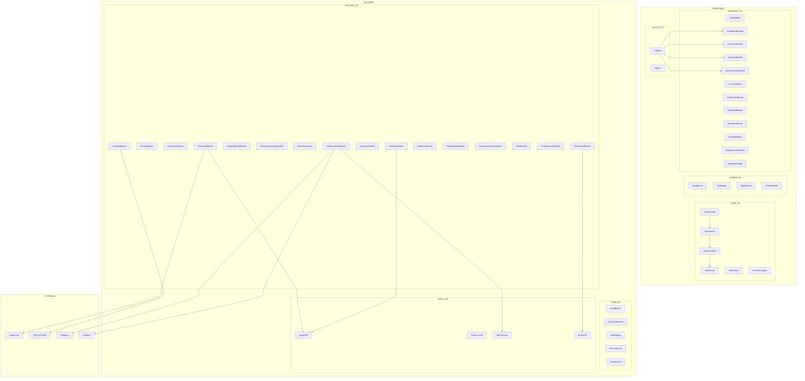
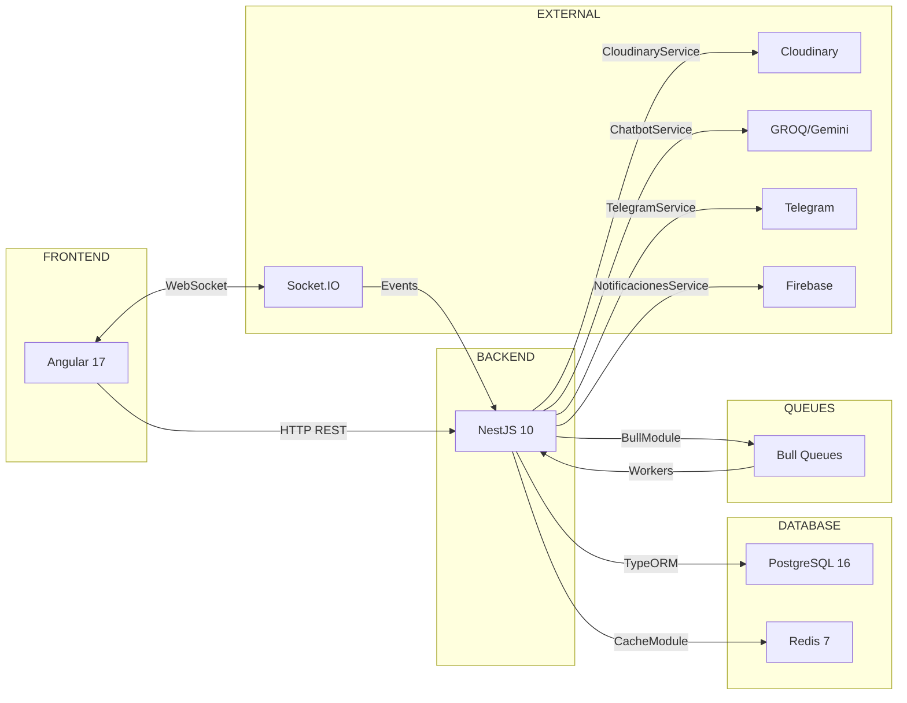

# Diagrama de Componentes — Sistema de Horarios Académicos UNT

| Campo | Valor |
|---|---|
| **Versión** | 1.0.0 |
| **Fecha** | 10/07/2026 |
| **Autor** | Equipo de Desarrollo — Escuela de Ingeniería de Sistemas, UNT |
| **Estado** | Revisado |

---

## Índice

1. [Descripción general](#1-descripción-general)
2. [Diagrama Mermaid: Componentes del sistema](#2-diagrama-mermaid-componentes-del-sistema)
3. [Tabla de componentes backend](#3-tabla-de-componentes-backend)
4. [Tabla de componentes frontend](#4-tabla-de-componentes-frontend)
5. [Dependencias entre componentes](#5-dependencias-entre-componentes)
6. [Historial de cambios](#6-historial-de-cambios)

---

## 1. Descripción general

El sistema está diseñado bajo los principios de **responsabilidad única**, **bajo acoplamiento** y **alta cohesión**. Cada módulo encapsula una funcionalidad específica del dominio académico, con interfaces bien definidas que permiten la comunicación entre componentes sin crear dependencias circulares.

### Principios de diseño

- **Responsabilidad única**: Cada módulo backend y frontend tiene una única razón de cambio. Un módulo de autenticación no gestiona horarios, un módulo de reportes no modifica declaraciones.
- **Bajo acoplamiento**: Los módulos se comunican a través de servicios inyectados y eventos, no directamente entre sí. Los módulos frontend son independientes y se cargan de forma lazy.
- **Alta cohesión**: Cada módulo agrupa entidades, controladores, servicios y DTOs que trabajan juntos para resolver un problema del dominio.

### Arquitectura modular

El sistema sigue una arquitectura modular tanto en el backend (NestJS modules) como en el frontend (Angular lazy-loaded modules). Esta separación permite:

- Desarrollo paralelo por equipos
- Pruebas unitarias aisladas por módulo
- Despliegue independiente de funcionalidades
- Escalabilidad horizontal del backend

---

## 2. Diagrama Mermaid: Componentes del sistema



### Leyenda del diagrama

| Color / Forma | Significado |
|---|---|
| Subgraph `FRONTEND` | Capa de presentación Angular 17 |
| Subgraph `BACKEND` | Capa de lógica de negocio NestJS 10 |
| Subgraph `EXTERNAL` | Servicios externos consumidos por el backend |
| Flechas `-->` | Dependencia o flujo de datos entre componentes |

---

## 3. Tabla de componentes backend

| Componente | Responsabilidad | Dependencias |
|---|---|---|
| **AuthModule** | Autenticación JWT, autorización por roles, login, registro, cambio de contraseña | JwtStrategy, JwtAuthGuard, RolesGuard, Usuario entity |
| **DocentesModule** | CRUD docentes, jerarquía, asignación de cursos y ambientes, fotos (Cloudinary) | TypeORM, Cloudinary, Curso entity, Ambiente entity |
| **CursosModule** | CRUD cursos, ambientes compatibles, grupos, prerrequisitos | TypeORM, PlanEstudios entity, Ambiente entity |
| **AmbientesModule** | CRUD ambientes, disponibilidad semanal, mapa de campus | TypeORM, Disponibilidad entity |
| **HorariosModule** | Asignación manual, generación automática, detección de conflictos, publicación | TypeORM, Socket.IO, Bull Queues, DisponibilidadModule |
| **DisponibilidadModule** | Grilla semanal de docentes, restricciones institucionales | TypeORM, ConfiguracionModule |
| **VentanasModule** | Turnos de atención, cola en tiempo real, selección de celdas | Socket.IO, Redis Cache, HorariosModule |
| **DeclaracionCargaModule** | Declaraciones de carga lectiva/no lectiva, flujo de estados, firmas | TypeORM, Bull Queues, NotificacionesModule |
| **ReportesModule** | Generación PDF (Puppeteer) y Excel (ExcelJS) de reportes y formatos oficiales | TypeORM, HorariosModule, DeclaracionesModule |
| **DashboardModule** | KPIs, heatmap de ocupación, alertas en tiempo real (WebSocket) | TypeORM, Socket.IO, Redis Cache |
| **NotificacionesModule** | Push notifications, Telegram bot, Bull queues para envío asincrónico | Bull Queues, Telegram, Firebase |
| **AuditoriaModule** | Trazabilidad de cambios en declaraciones y horarios | TypeORM, Bull Queues |
| **PlanEstudiosModule** | Planes de estudio, cursos del plan, prerrequisitos | TypeORM, Curso entity |
| **AsignacionLectivaModule** | Asignación de carga lectiva por docente con estados | TypeORM, Docente entity, CursoPlanEstudios entity |
| **CladModule** | CLAD con flujo de 7 estados | TypeORM, DeclaracionesModule |
| **ConfiguracionModule** | Restricciones institucionales, parámetros de carga, config general | TypeORM, Redis Cache |
| **ChatbotModule** | Asistente IA para consultas del sistema | GROQ/Gemini API |

---

## 4. Tabla de componentes frontend

| Componente | Responsabilidad | Tipo |
|---|---|---|
| **CoreModule** | Servicios compartidos (AuthService, ApiService), guards (AuthGuard, RolesGuard), interceptors (JwtInterceptor, ErrorInterceptor) | Singleton (forRoot) |
| **AuthModule** | Login, landing page, cambio de contraseña, recuperación | Lazy-loaded |
| **LayoutModule** | Sidebar responsive, topbar con notificaciones, breadcrumb, logout | Eager |
| **SharedModule** | Componentes reutilizables: AppSpinner, AppBadge, AppKpiCard, ScheduleGrid, ConfirmDialog, AppHeader | Shared |
| **DashboardModule** | Panel principal con KPIs, gráficos, heatmap de ocupación, alertas en tiempo real | Lazy-loaded |
| **DocentesModule** | CRUD de docentes, asignación de cursos y ambientes, perfil con foto | Lazy-loaded |
| **CursosModule** | CRUD de cursos, detalle con tabs (información, ambientes, grupos), prerrequisitos | Lazy-loaded |
| **AmbientesModule** | CRUD de ambientes, disponibilidad semanal, mapa de campus | Lazy-loaded |
| **HorariosModule** | Asignación manual/automática de horarios, grilla semanal, detección de conflictos, publicación | Lazy-loaded |
| **DisponibilidadModule** | Grilla de disponibilidad por docente, restricciones institucionales | Lazy-loaded |
| **DeclaracionesModule** | Declaraciones de carga lectiva/no lectiva, flujo de estados, drag-and-drop para horarios no lectivos | Lazy-loaded |
| **ReportesModule** | Generación y descarga de reportes PDF/Excel por tipo (docente, ambiente, ciclo, consolidado) | Lazy-loaded |
| **OperadorModule** | Operación de ventanas de atención en tiempo real, cola de turnos, asignación de celdas | Lazy-loaded |
| **ChatbotModule** | Asistente IA integrado para consultas del sistema | Lazy-loaded |
| **NotificacionesModule** | Centro de notificaciones, historial, configuración de preferencias | Lazy-loaded |
| **AuditoriaModule** | Historial de cambios en declaraciones y horarios con filtros avanzados | Lazy-loaded |
| **PlanEstudiosModule** | Mantenedor del plan de estudios 2018, cursos del plan, prerrequisitos | Lazy-loaded |
| **AsignacionLectivaModule** | Asignación de carga lectiva por docente con estados de aprobación | Lazy-loaded |
| **ConfiguracionModule** | Configuración general del sistema, restricciones institucionales, parámetros de carga | Lazy-loaded |
| **MisHorariosModule** | Vista del docente de su propio horario asignado con exportación PDF/Excel/iCalendar | Lazy-loaded |

### Distribución de módulos lazy-loaded

```
frontend/src/app/modules/
├── auth/                    # AuthModule
├── dashboard/               # DashboardModule
├── docentes/                # DocentesModule
├── cursos/                  # CursosModule
├── ambientes/               # AmbientesModule
├── horarios/                # HorariosModule
├── disponibilidad/          # DisponibilidadModule
├── declaraciones/           # DeclaracionesModule
├── reportes/                # ReportesModule
├── operador/                # OperadorModule
├── chatbot/                 # ChatbotModule
├── notificaciones/          # NotificacionesModule
├── auditoria/               # AuditoriaModule
├── plan-estudios/           # PlanEstudiosModule
├── asignacion-lectiva/      # AsignacionLectivaModule
├── configuracion/           # ConfiguracionModule
└── mis-horarios/            # MisHorariosModule
```

---

## 5. Dependencias entre componentes

### 5.1 Frontend → Backend

| Protocolo | Uso |
|---|---|
| **HTTP REST API** | Comunicación síncrona para CRUD, consultas y reportes. Todas las peticiones pasan por `JwtInterceptor` que agrega el token Bearer. |
| **Socket.IO WebSocket** | Comunicación asincrónica en tiempo real para ventanas de atención, dashboard alerts y notificaciones push. |

### 5.2 Backend → Base de datos

| Componente | Uso |
|---|---|
| **TypeORM** | ORM para todas las queries a PostgreSQL. Configurado con `autoLoadEntities: true` y `synchronize: true` en desarrollo. |
| **Redis Cache** | Cache distribuido para sesiones, tokens y datos de alta frecuencia (disponibilidad, configuración). |
| **Bull Queues** | Colas asincrónicas para envío de notificaciones, generación de reportes pesados y procesamiento de declaraciones. |

### 5.3 Backend → Servicios externos

| Servicio | Uso |
|---|---|
| **Cloudinary** | Almacenamiento y optimización de imágenes (fotos de docentes, logos institucionales). |
| **GROQ / Gemini** | API de IA para el chatbot del sistema que responde consultas sobre horarios y carga académica. |
| **Telegram** | Bot de Telegram para notificaciones a docentes sobre cambios en horarios y declaraciones. |
| **Firebase** | Cloud Messaging (FCM) para push notifications en navegadores y dispositivos móviles. |

### 5.4 Diagrama de dependencias



---

## 6. Historial de cambios

| Versión | Fecha | Autor | Descripción del cambio |
|---------|-------|-------|------------------------|
| 1.0.0 | 10/07/2026 | Equipo de Desarrollo | Versión inicial del diagrama de componentes |
