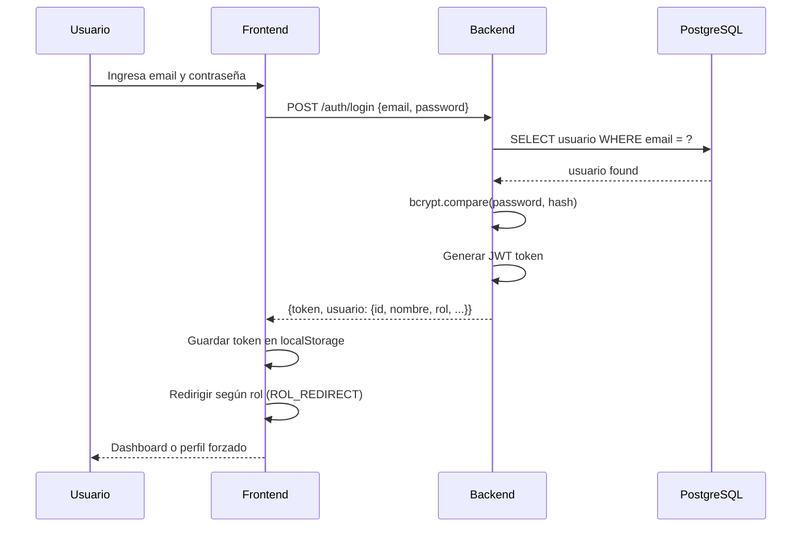
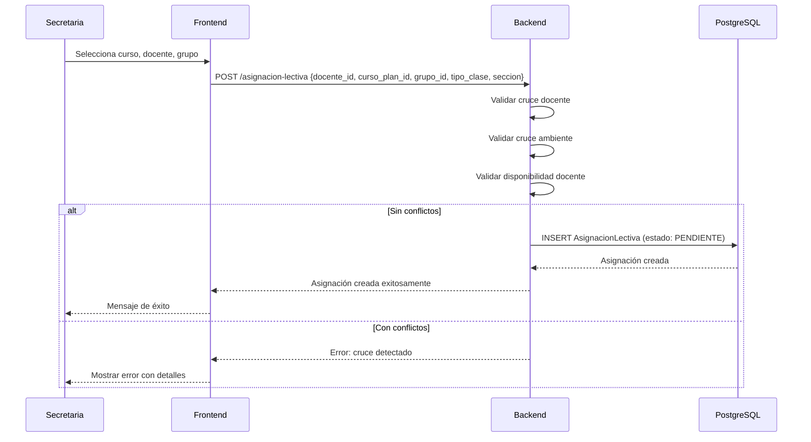
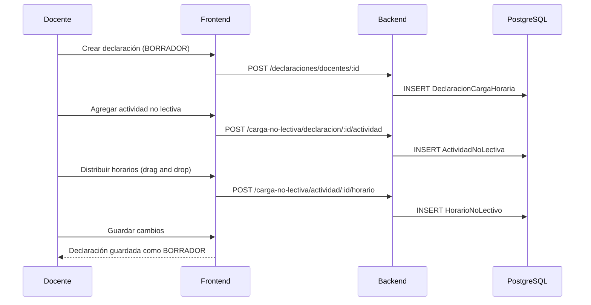
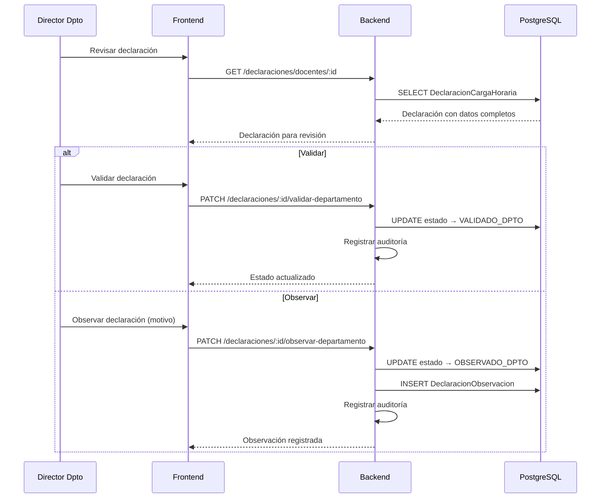
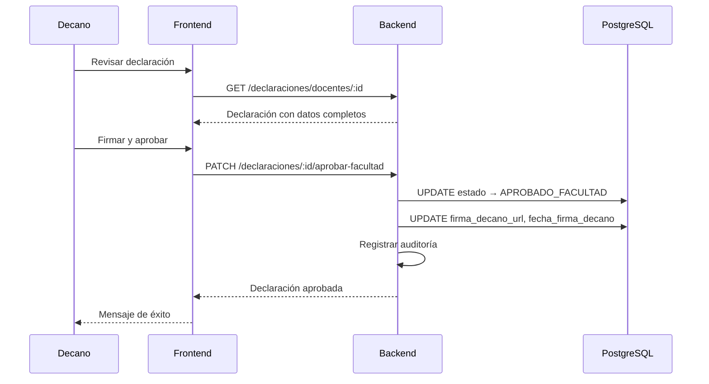
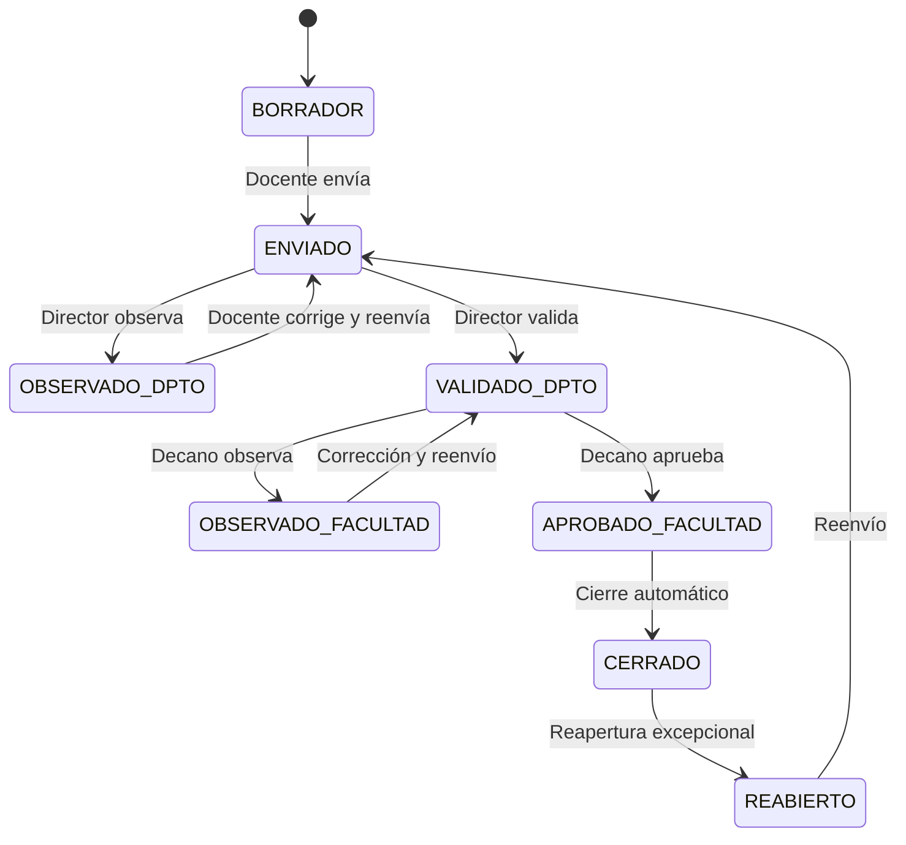
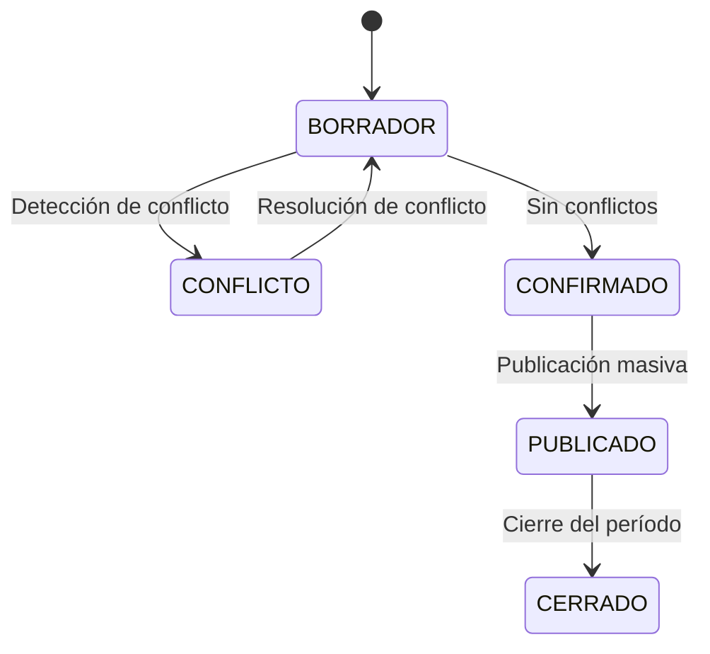
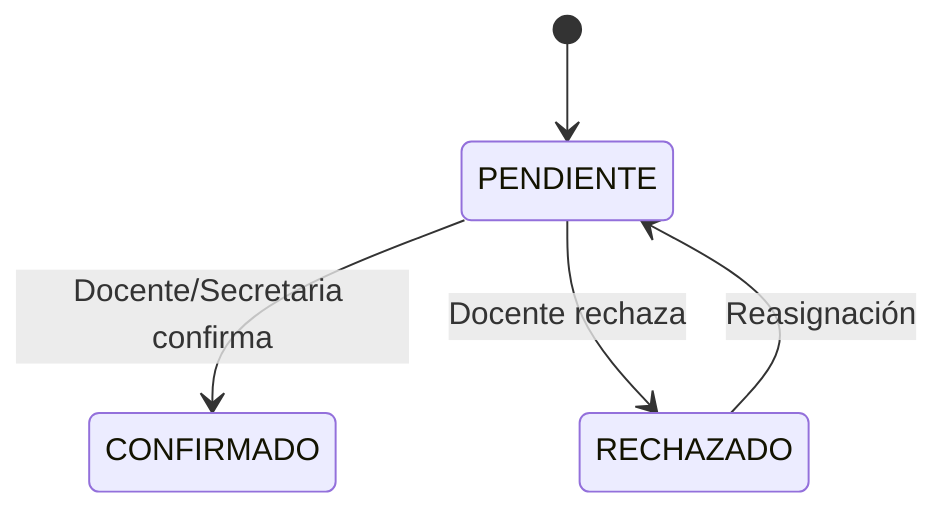
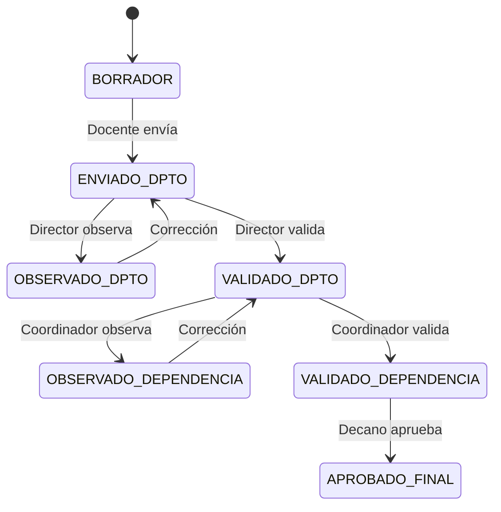
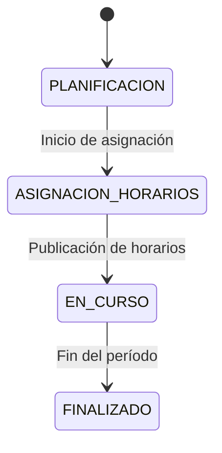

# Diagramas de Secuencia y Estados

| Campo    | Valor                                                              |
| -------- | ------------------------------------------------------------------ |
| Versión  | 1.0.0                                                              |
| Fecha    | 10/07/2026                                                         |
| Autor    | Equipo de Desarrollo — Escuela de Ingeniería de Sistemas, UNT     |
| Estado   | Revisado                                                           |

---

## 1. Diagramas de secuencia

### 1.1. Login y autenticación

> El usuario ingresa credenciales. El backend valida contra PostgreSQL, genera un JWT y retorna los datos del usuario. El frontend almacena el token y redirige según el rol.

### 1.2. Asignación de carga lectiva por Secretaria

> La secretaria selecciona curso, docente y grupo. El backend valida cruce de docente, ambiente y disponibilidad. Si no hay conflictos, crea la asignación con estado PENDIENTE.

### 1.3. Registro de carga no lectiva por Docente

> El docente crea una declaración, agrega actividades no lectivas y distribuye sus horarios usando el componente de arrastrar y soltar.

### 1.4. Validación por Director de Departamento

> El Director de Departamento revisa la declaración. Puede validarla (transición a VALIDADO_DPTO) u observarla con un motivo (transición a OBSERVADO_DPTO).

### 1.5. Aprobación final por Decano

> El Decano revisa la declaración validada por el Director de Departamento, la firma digitalmente y la aprueba, transicionando a APROBADO_FACULTAD.

---

## 2. Diagramas de estados

### 2.1. Ciclo de vida de Declaración de Carga

> La declaración de carga sigue un flujo lineal de 8 estados: BORRADOR → ENVIADO → OBSERVADO_DPTO / VALIDADO_DPTO → OBSERVADO_FACULTAD / APROBADO_FACULTAD → CERRADO / REABIERTO.

### 2.2. Ciclo de vida de Horario Asignado

> El horario asignado pasa por 5 estados: BORRADOR (creación), CONFLICTO (si hay cruce), CONFIRMADO (sin conflictos), PUBLICADO (visible para todos), CERRADO (período finalizado).

### 2.3. Ciclo de vida de Asignación de Carga Lectiva

> La asignación de carga lectiva tiene 3 estados: PENDIENTE (recién creada), CONFIRMADO (aceptada), RECHAZADO (rechazada por el docente).

### 2.4. Ciclo de vida de CLAD

> El CLAD sigue un flujo de 7 estados con validación en departamento y dependencia, terminando con aprobación final del Decano.

### 2.5. Ciclo de vida de Período Académico

> El período académico tiene 4 estados: PLANIFICACION, ASIGNACION_HORARIOS, EN_CURSO, FINALIZADO.
